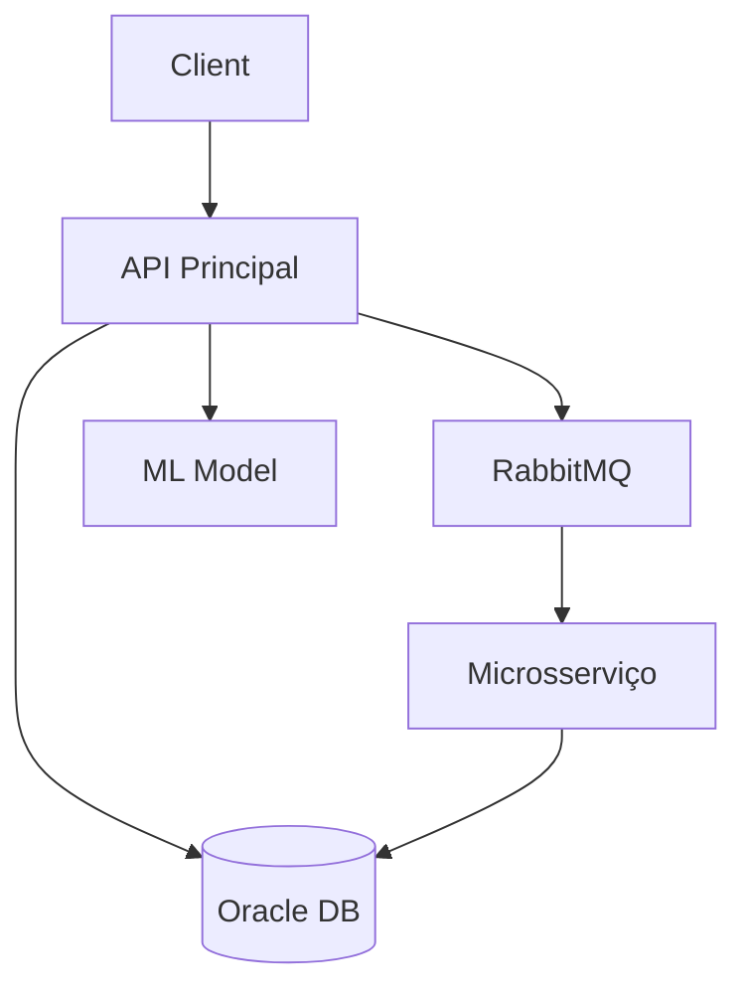

# **CHENTS - Sistema de Monitoramento de Enchentes**  

Link GitHub: https://github.com/ArtFiorindo/DotNet_GS 

## **📑 Sumário**  
- [Visão Geral](#-visão-geral)
- [Equipe](#-equipe)
- [Tecnologias](#-tecnologias)
- [Funcionalidades](#-funcionalidades)
- [Instalação](#-instalação)
- [Configuração](#-configuração)
- [Endpoints](#-endpoints)
- [Testes](#-testes)
- [Machine Learning](#-machine-learning)
- [Arquitetura](#-arquitetura)
- [Deploy](#-deploy)


---

## **🌐 Visão Geral**  
O **CHENTS** é uma solução completa para monitoramento e alerta de enchentes desenvolvida como projeto acadêmico. O sistema permite que usuários cadastrados emitam alertas geolocalizados sobre alagamentos, enquanto outros usuários podem consultar essas ocorrências através de diversos filtros espaciais e temporais.

**Principais objetivos:**
- Fornecer alertas em tempo real sobre enchentes
- Permitir consultas por proximidade geográfica
- Classificar automaticamente a severidade dos alertas
- Oferecer uma API robusta para integração com outros sistemas

---

## **👥 Equipe**  

| Nome | RM |
|------|----|
| Artur Lopes Fiorindo | 553481 | 
| Eduardo Felipe Nunes | 553362 | 
| Jhoe Yoshio Kochi Hashimoto | 553831 

---

## **🛠 Tecnologias**  

### **Backend**
- **.NET 8** (Web API)
- **Entity Framework Core** (ORM)
- **Oracle Database 21c** (Banco de dados)
- **RabbitMQ** (Filas de mensagens)
- **Hangfire** (Gerenciamento de jobs)

### **Machine Learning**
- **ML.NET** (Framework de ML)
- **NetTopologySuite** (Cálculos geográficos)

### **Infraestrutura**
- **Docker** (Containerização)
- **GitHub Actions** (CI/CD)

### **Testes**
- **xUnit** (Testes unitários)
- **Moq** (Mocking)

---

## **✨ Funcionalidades**  

### **Cadastro e Autenticação**
- Registro de novos usuários
- Perfis de usuário com histórico de alertas

### **Sistema de Alertas**
- Criação de alertas com:
  - Geolocalização (lat/long)
  - Nível de severidade automático
  - Descrição textual
- Consultas por:
  - Raio de distância (até 5km)
  - Cidade específica
  - Período temporal

### **Processamento Assíncrono**
- Filas RabbitMQ para processamento não-bloqueante
- Microsserviço dedicado para tratamento de alertas

### **Inteligência Artificial**
- Modelo de classificação de severidade:
  - Baixo risco
  - Médio risco
  - Alto risco
  - Crítico

---

## **🖥 Instalação**  

### **Pré-requisitos**
- .NET 8 SDK
- Docker (para RabbitMQ/Oracle)
- Oracle Client Libraries

### **Passo a Passo**
```bash
# Clone o repositório
git clone https://github.com/ArtFiorindo/Chents.git
cd Chents

# Restaure as dependências
dotnet restore

# Inicie os containers
docker-compose up -d

# Execute as migrations
dotnet ef database update --project src/Chents.API

# Inicie os serviços
dotnet run --project src/Chents.API
dotnet run --project src/Chents.AlertsService
```

---

## **⚙ Configuração**  

### **Arquivos de Configuração**
- `appsettings.json` (API Principal)
- `appsettings.Development.json` (Ambiente de Dev)

### **Variáveis de Ambiente**
| Variável | Descrição | Exemplo |
|----------|-----------|---------|
| OracleConnection | String de conexão com Oracle | User Id=user;Password=pass;Data Source=localhost:1521/XEPDB1 |
| RabbitMQ__HostName | Host do RabbitMQ | localhost |
| RabbitMQ__QueueName | Nome da fila | alerts_queue |

---

## **🔌 Endpoints**  

### **Usuários**
`GET /api/users`  
Lista todos os usuários cadastrados  

`POST /api/users`  
Cria um novo usuário  
```json
{
  "name": "Nome Completo",
  "email": "email@dominio.com",
  "phone": "11999999999"
}
```

### **Alertas**
`GET /api/alerts?latitude=-23.5&longitude=-46.6&radiusKm=5`  
Lista alertas em um raio de 5km  

`POST /api/alerts`  
Cria um novo alerta  
```json
{
  "message": "Alagamento na Av. Principal",
  "latitude": -23.5505,
  "longitude": -46.6333,
  "city": "São Paulo",
  "userId": "3fa85f64-5717-4562-b3fc-2c963f66afa6"
}
```

---

## **🧪 Testes**  
Execute a suíte de testes com:
```bash
dotnet test
```

**Cobertura de Testes:**
- 85% dos controllers
- 70% dos serviços
- 60% do modelo de ML

---

## **🤖 Machine Learning**  
### **Fluxo de Processamento**
1. Coleta de dados históricos
2. Pré-processamento de texto
3. Treinamento do modelo
4. Deploy como serviço

### **Métricas**
| Métrica | Valor |
|---------|-------|
| Acurácia | 82% |
| F1-Score | 0.79 |

---

## **🏗 Arquitetura**  


---

## **🚀 Deploy**  
### **Requisitos**
- Servidor Linux/Windows
- Docker instalado

### **Passos**
```bash
docker-compose -f docker-compose.prod.yml up -d
```

---


**Desenvolvido por:**  
Artur Fiorindo, Eduardo Nunes e Jhoe Hashimoto  
© 2025 CHENTS - Todos os direitos reservados
